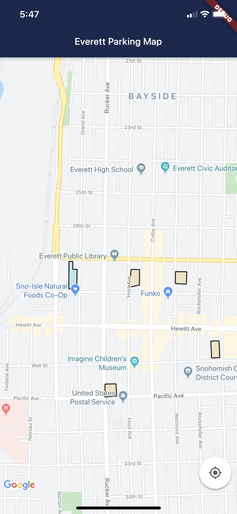
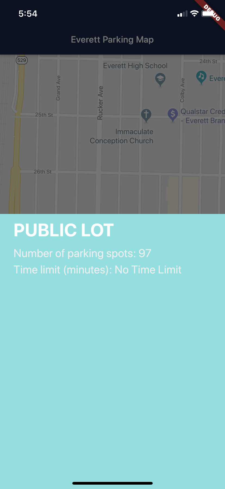
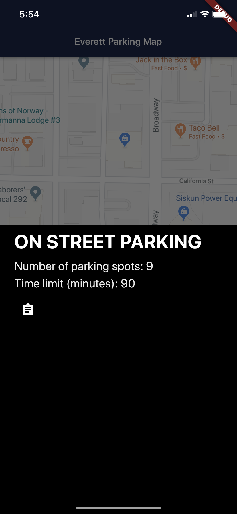
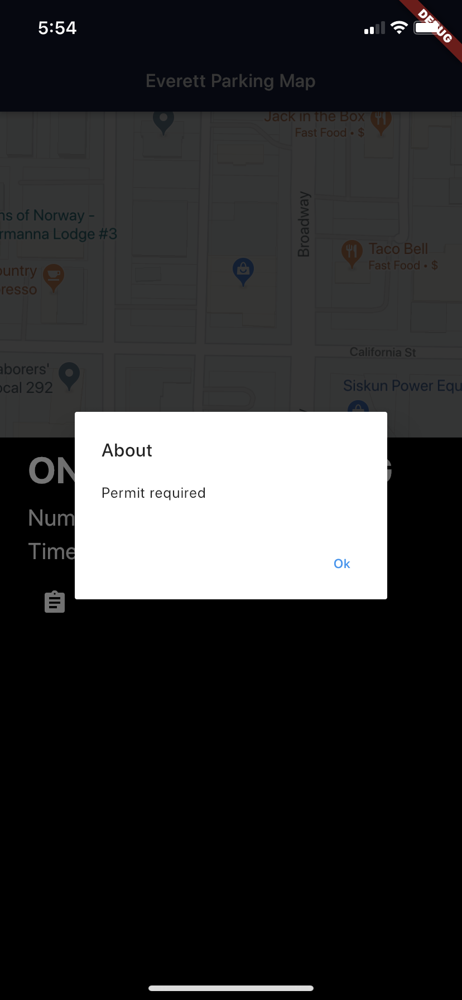

# Everett Parking App
## Coughacks 2020 Project

## Team
Jeremy Tandjung : https://github.com/jeremyimmanuel  
Jun Zhen        : https://github.com/jpzhen  
Krish Kalai     : https://github.com/krishkalai07  

Also, check out our fourth member's repositories, who unfortunately couldn't come to the hackathon due to ilness. 
Nathan Phan : https://github.com/irredentist

## Problem
Residents and visitors find it difficult to find on street parking within the downtown area of Everett. Past parking utilization studies have shown there may be enough parking stalls in the downtown, but public perception is parking availability is a challenge.

## Solution
A mobile app that lets users see parking lots in Everett's downtown area based on Everett's 2015 Central Business District Parking map (https://coughacks.io/datasets/CBD%20PARKING%202015-Map.pdf).

We have separates repoes for the Front-end side (a mobile application) and the Back-end side (a sql-backed python flask server). You can visit the repoes through the link below:
Front-end:  https://github.com/jeremyimmanuel/everett-parking-front-end
Back-end:   https://github.com/jeremyimmanuel/everett-parking-back-end

# Front End
## Two Platforms, One Codebase

For this project, we have decided to adopt Google's Flutter SDK to develop our app. For those of you who don't know, Flutter is a cross platform mobile app development that lets you develop both android and iOS applications all in one code base, written in Dart. You can visit the [official flutter website](https://flutter.dev) for more information.

## Goal
For this hackathon, we set our goals to at least get an MVP, which has the following requirements:
* User is able to find parking spots/lots
* User is able to see the capacity of each parking spots.
* User is able to identify what kind of lot it is (private, or public, etc)

## Google Maps
A map is a crucial part in this app as it shows the locations of various places in Everett __including__ the parking spaces/lots. Therefore, we decided to use Google Maps SDK as our map of choice.

## Everett Parking API
As we mentioned before, since the provided data is a static image, we made our own RESTful API to provide the app with meaningful data. Right now, the app only sends GET request; however, in a later section, we will discuss the future of the apps and potential improvement that involves using the API more heavily. 

__As of right now, the back-end is not working fully yet because the we haven't edited a dynamic path for the database file. Will remove this sentence when db is uploaded__

## Datapoints
Since the resource that we have is a static image of the availale parking spots/lots, we made our own database-backed server and manually input it with the relevant coordinates. For the purpose of this hackathon, we took account of only 6 places as a proof of concept. Details about our server side (back-end) can be viewed in the back-end repo attached above.

We managed to make an mvp that satisfy the goals mentioned above

## Screenshots
   

## Short Demo
Click this [link](https://youtu.be/dDfc4tU8x98) to see a short demo showing you how the app works in real life.

# Back-end
## To be written...

# Instructions
## Back-end
1. Check you ip address
2. Run the server

## Front-end
1. Make sure you have the flutter SDK installed and have an internet connection
2. Download this repo (front-end)
3. Run `flutter pub get` in the root directory of this project
4. For android you can play on a simulator or a real device by running 'Debug' or press f5
5. For iOS simulator, you can do it like the previous step. However, the real iPhones, you have to get xcode.

# Future 
In the future we would like to implement the following features:
1. User can see their current location
2. User can pick a parking space and get directions from their current location to the desired parking space
3. Dark mode
4. User can check in to a parking space/lot
5. Server will have more accurate data

# Technology Used
## Front-end
1. Flutter
2. Dart
3. Google Cloud console
4. Google Maps SDK

## Back-end
1. Python
2. SQL
3. JSON

# Conclusion
Overall we had an awesome time at the hackathon. Shout out to WSU Everett ACM and their sponsors for organizing this event! 

## Getting Started

This project is a starting point for a Flutter application.

A few resources to get you started if this is your first Flutter project:

- [Lab: Write your first Flutter app](https://flutter.dev/docs/get-started/codelab)
- [Cookbook: Useful Flutter samples](https://flutter.dev/docs/cookbook)

For help getting started with Flutter, view our
[online documentation](https://flutter.dev/docs), which offers tutorials,
samples, guidance on mobile development, and a full API reference.
